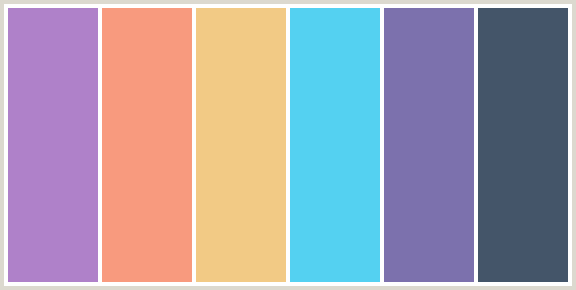

# AGame

## <i> Full Stack Frameworks With Django - Code institute MS4 project </i>

---

## Demo


[](https://agame-app-ms4.herokuapp.com/)

---

**AGame** - Is an online Game subscription service where you can come and get on your A Game!

This is my AGame Website, that I have created using HTML, CSS, Javascript and Python code using Django and then deployed on Heroku. 
This website is intended for users to be able to be able to sign up for a Game subscription that will then enable them to download and then
play games, they will also be able to shop on the merchandise store. all while using having an account that can track their subscription status
and also view their account order history and cancel their subscription.

## Table of Contents

1.  [**UX**](#ux)
    - [**Project Goals**](#project-goals)
    - [**User Stories**](#user-stories)
    - [**Design**](#design)
    - [**Layout**](#layout)
    - [**Font**](#font)
    - [**Colours**](#colours)
    - [**Icons**](#icons)
    - [**WireFrames**](#wireframes)
2.  [**Structure**](#structure)
    - [**Basic Structure**](#basic-structure)
    - [**Navigation**](#navigation)
    - [**Home Page**](#home-page)
    - [**Merchandise**](#merchandise)
    - [**Product Details**](#product-details)
    - [**Shopping Cart**](#shopping-cart)
    - [**Checkout**](#checkout)
    - [**Checkout Success**](#checkout-success)
    - [**Games Page**](#games-page)
    - [**Subscriptions Page**](#subscriptions-page)
3.  [**Technologies Used**](#technologies-used)
4.  [**Testing**](#testing)
5.  [**Deployment**](#deployment)

---

# UX

### **Project Goals**

The Aim of my project was to be able to create a site where the user could go to find games to play and then pay a small subscription fee to play them,
they could also shop on the merhandise store and be able to purchase products from this, and with a "PRO" subscription they would also get
10% off on the store and also free delivery as a perk to go from the free subscription to the PRO version. along with this they would also need
a profile account that they could login with, and with this track their order history and be able to cancel their subscription as they wish.

### User Stories

#### User:

1. As a User I want to be able to view a list of games I can play so I can see what I want to play.
2. As a User I want to be able to Easily Register for an Account so I can View my profile.
3. As a User I want to be able to Easliy login and logout so I can Access my personal profile.
4. As a User I want to be able to Easily Recover my Password So I can regain Access to my Account.
5. As a User I want to be able to Recieve an Email Confirming After Registering on the site So I can Verify my Registration was successful.
6. As a User I want to be able to Have a Personlized account So I can view my order history and save my personal Information.
7. As a User I want to be able to see a specific category of product in the store so I can find what I want.
8. As a User I want to be able to Search for a Product by Name or description So that I can find a specific prouduct I want.
9. As a User I want to be able to Easily see what I have searched for So that I can decide wether I want the product.
10. As a User I want to be able to View individual Product Details So it can See the Price, description and information.
11. As a User I want to be able to View the total cost of my purchase at any time So I can avoid spending too much.
12. As a User I want to be able to View the subscriptions available to me So that I can see how much it costs.
13. As a User I want to be able to View the indiviudal games that I can play So that I can download them and play.
14. As a User I want to be able to cancel my subscription at any point So that I no longer pay for it.
15. As a User I want to be able to view my subscription status so that I can see if it is active or not.
16. As a User I want to be able to Login with a Social media Account So it's easier for me to be able to login.

#### Admin:

17. As a Admin I want to be able to Add a product So that I can add new products to the merchandise page.
18. As a Admin I want to be able to Edit/Update an Item So that I can change details about the product.
19. As a Admin I want to be able to Delete a product So that I can remove item not for sale anymore.
20. As a Admin I want to be able to Add new Games So that I can increase the Library of Game avaialbe to a User.

<div align="right">

[Back to Top :arrow_up:](#table-of-contents)

</div>

### **Design**

Most of the design of my website came from inspiration from another Game subscription website such as 
[Xbox Game Pass](https://www.xbox.com/en-GB/xbox-game-pass)
This sites helped with the information that I was going to need and the layout of my website.

### layout

The Layout of the site was using a Grid formation and layout taken from the [Bootstrap](https://getbootstrap.com/) webiste, 
this webiste was designed heavily off the back of the Boutique Ado mini project, that was done just before this milestone project,
As I feel this had the perfect base layout for creating my webiste and a mobile first approach.

### Font

The fonts that I decided to use was "Roboto Slab" and "Sans serif" as a backup and found this using 
[Google fonts website](https://fonts.google.com/) Which worked well from my previous Project.

### Colours

The Colours were found from a website called [Color Combos](https://www.colorcombos.com/color-schemes/2026/ColorCombo2026.html)
the colours used were purple, grey and mostly a light blue as it complemented my AGame Logo.



### Icons

The Icons used on this site were taken from the website [Font Awesome](https://fontawesome.com/)

### WireFrames

The wireframes were created using the Balsamiq application, you can view my PDF of the wireframes
that were created at the beginning of this project and have not been modified based on the final look of the website. 
[Download Wireframes Here](https://github.com/djacura/AGame/raw/master/assets/AGame%20wireframes%20PDF.pdf)

<div align="right">

[Back to Top :arrow_up:](#table-of-contents)

</div>

---

# Structure

## Basic Structure

The basic structure of the web page is

- _Navigation_ - Top level
- _Body_ - Main page elements
- _Footer_ - Logo, legal and social links

### Sign Up (Registration) and Login

I have used a 3rd Party package called [Allauth](https://django-allauth.readthedocs.io/en/latest/) to take care of the logic.
The users are asked to fill in the Registration with fields ‘Email’, ‘Username’, and password, this is done twice to make sure they are both the same.
You may also use the social account to sign up and create an account. all accounts start with a 'Free' Membership when created.

**Sign Up and Login.**
You may use the social account buttons to sign in or use the form.
The form has two fields, ‘email’ and ‘Password’ and a remember me button and a link to your if you have forgotten your password.
All of [Allauth](https://django-allauth.readthedocs.io/en/latest/) I have customised the forms and buttons to fit the themes of the site.

## Navigation

#### Navbar

The navbar is fixed to top of each page, This makes navigation easer and quicker.

- **Left - AGame Logo** - Clickable link to the home page from anywhere on the web site.
- **Center - Page navigation** - This is the main pages navigation to pages and changed depending on login and user auth.
- **Right - User and Cart** - This has the user profile area and also the cart.

#### The Footer

The footer stays at the bottom of each page.
It is broken into 3 sections.

- **Sections 1** - Is the Logo and educational info.
- **Sections 2** - has the links to the privacy and legal policy sections of the site.
- **Sections 3** - is where the social links are that can target to take the user to the social sites for this website.

---

<div align="right">

[Back to Top :arrow_up:](#table-of-contents)

</div>

## Home Page

The home page or Index page is the main page for users to interact with.
And it is divided into 4 sections.

#### Section 1

This section is the main part of the page which ther users first see, a full page background, with a floating jumbotron
that welcomes the users to the site and tells them what to expect of the site.

#### Section 2

This area is for the About us esection which gives users quick 4 points of the best parts of AGame, and what we are about.

#### Section 3

This section of the site just gives users a brief look at what games they can expect to play when the subscribe to the service.

#### Section 4

This section is a collapsible area for the most frequently asked question of users to the site also based off the manual testing 
that I had some people carry out and then gathered the most asked questions which populated this section.

---

## Merchandise

- **Search bar**
  This is where you can search the merchandise store for what you are looking for.

- **Category Area**
  This where the User can select the category they are looking for so they can narrow their search down to the specifc category they are looking for.

- **Products**
  The products are displayed on cards, are positioned side by side in rows.
  - Picture - is at the top.
  - Then the name of the product.
  - Then the Price of the product is displayed in bold numbers.
  - Then the Stars ratings.

---

## Product Details

The product Details page is layed out like follows: \
The center is divided in half, the left hand side has picture of the product, and on the right is the information:

- Name of the product
- Price of product
- Category of product
- Stars Rating
- Description of the product
- Quantity selector
- Buttons for Keep shopping and Add to cart.

Then Below the product details section is the Comments section.

- Form to fill out including name and review
- then all comments will be listed out below the product.

I also wanted to add a rating element to the comments that would then change the rating of the products as the reviews were added. and I also
Wanted to set up this section so that when a user logs in they wouldnt have to add their name it would do that already but didnt have enough time
so will probably add this at a later date.

---

## Shopping Cart

The Shopping Cart is where you see a list of all the products that you have added to your cart. \
This has a table Row Design on desktop and a list type in mobile view. \
Which consists of a list of all the products and information:

- Image on the left
- Product info - including the name the size (if applicable) and SKU number
- Price
- Quantity and quantity adjuster - Here you see the quantity of a product, you can increase and descrease the amount \
    and also you can update and then removed the product from your cart from here as well.
- Subtotal - this calculated the subtotal of how many items you had of this type.

In the bottom right corner is the The Order Summary which holds all the financial details of the order:

- Cart Total
- Discounts - (if any applicable)
- Subtotal amount
- Delivery charge (if applicable)
- Grand Total
- Keep shopping button - which will take you back to the shop.
- Secure Checkout button - which will take to the check out.

---

## Checkout

Full page layout with a user order form to complete: \
This form would also be filled in automatically from the details stored in the My profile section of the site.

Customer details section:

- Full name 
- Email Address

Delivery Info:

- Phone number
- Address lines 1 and 2
- Town or city
- county
- postal code
- Country selector drop down

Payment card details: 

- You have a card element box the customer uses to fill in their card details as below.

> #### Stripe Development Card
>
> A [Stripe](https://stripe.com/) payment system is inplace and >takes all major cards.
> The numbers below are used to test the Stripe Payment software.
>
> - Card number - 4242 4242 4242 4242
> - CVC - Any 3 digit number.
> - Expire date - Any date in the future

Then the customer clicks on the Complete Order button to complete their order or Adjust cart button to go back to the cart.

- Complete Order - Sends the card informtion to [Stripe](https://stripe.com/)


## Checkout Success

This page is where the user will come if the checkout was a success and does not error.

This is layed out with Two shadow blocks one on the left and right both hold all your order details.

### Left block contains:

Order details:

- Order Number
- Order date

Order Details:

- the items that where brought, incl how much each.

Billing details:

- Order Total
- Delivery Charges
- Grand Total

### Right Block contains:

Delivery Info:

- Full Name
- Phone Number

Address Details:

- Address 1 and 2
- Town or city
- County
- postcode
- Country

and this will only show what is actually inputted into the form.

---

<div align="right">

[Back to Top :arrow_up:](#table-of-contents)

</div>

## Games Page

- **Title**
  This is the Title of the Page

- **Search bar**
  This is where you can search the Games page for what games you want.

- **Games**
  The games are displayed on cards, are positioned side by side in rows.
  - Picture - is at the top.
  - Then the title of the Game.

## Game Details

The game Details page is layed out like follows: \
The center is divided in half, the left hand side has picture of the product, and on the right is the information:

- Title of the Game
- Description of the Game
- Button to download or play the game

---

## Subscriptions Page

This is where the user will come to subscribe to AGame \
This is layed out with Two shadow blocks one on the left and right both hold the details of the subscriptions.

- The Membership Name
- The Price per month for the Membership
- And what each Membership includes

This also then goes on to the Subscritions payment page which is very simple and has just a reminder of what the user is subscribing to
and then a Stipe card element same as the checkout page to take customer details and then subscribe to the site.

---

## My Profile Page

This page is where the user will come to view their personlised profile page

This is layed out with 3 shadow blocks, layed out across the page on desktop and stacked on mobile view. the blocks contain info as follows:

### Left block contains:

Profile Admin:

- User Email
- Current subscription
- Membership since (if subscribed)
- Next paymentr date (if subscribed)
- Cancel Subscription button (if subscribed)
- Password reset button

### Centre Block contains:

Default Delivery Info:

- Full Name
- Phone Number
- Address 1 and 2
- Town or city
- County
- postcode
- Country selector
- button to update information.

**If save info selector box is checked on the checkout page then that info saves into this area.**

### Right Block contains:

Order History:

- Order number
- Date of order
- Items in order
- Order total

---

# **Technologies Used**

This Project Uses HTML, CSS, Javascript, Python, and Django Technologies.

* [Python](https://www.python.org/) ~ was used to create the logic code.
* [Django](https://www.djangoproject.com/) ~ Django is a high-level Python Web framework.
* [Jquery](https://jquery.com/) ~ was used for the Javascript Elements.
* [Bootstrap 4.5](https://getbootstrap.com/) ~ Design and customize responsive mobile-first sites.
* [HTML 5](https://en.wikipedia.org/wiki/HTML) ~ Markup language designed for the web browser.
* [CSS 3](https://en.wikipedia.org/wiki/Cascading_Style_Sheets) ~ Style sheet language used for styling the HTML.
* [Github](https://github.com/) ~ was used to store the code in a repository and then [Gitpod](https://www.gitpod.io/) was used to write the code.
* [Heroku](https://www.heroku.com/) ~ was used to deploy the site to the internet.
* [Heroku Postgres](https://www.heroku.com/postgres) ~ PostgreSQL's used for database.
* [Font Awesome](https://fontawesome.com/) ~ Font Awesome icons
* [Google Fonts](https://fonts.google.com/) ~ A library free licensed font families, an interactive web directory for browsing the library.
* [Slack](https://slack.com/intl/en-ie/) ~ A workspaces allowing you to organize communications by channels for group discussions and allows for private messages to share information.

<div align="right">

[Back to Top :arrow_up:](#table-of-contents)

</div>

---

# Testing

Testing, Bugs and Validation information and be found at [Testing.md](https://github.com/)

---

# Deployment

## Local Deployment

To be able to clone this project there are a few things you will need.

- [Git](https://git-scm.com/) - Install Git, installation docs and be found [here](https://git-scm.com/book/en/v2/Getting-Started-Installing-Git)
- [Pip](https://pip.pypa.io/en/stable/installing/) - install pip, installation docs can be found [here](https://pip.pypa.io/en/stable/installing/)
- A [Gmail](https://www.gmail.com/mail/help/intl/en/about.html?utm_expid=...) account with app secret key.

Once you have [Git](https://git-scm.com/) and [Pip](https://pip.pypa.io/en/stable/installing/) installed.

1. From the terminal create the directory you want to work in.

   ```bash
   $ mkdir <filename>
   ```

2. Change into Directory

   ```bash
   $ cd <filename>
   ```

3. Clone the repository from github.

   ```bash
   $ git clone https://github.com/djacura/AGame.git
   ```

4. Change into AGame directory.

   `$ cd AGame`

5. Install [virtualenv](https://pypi.org/project/virtualenv/)

   ```bash
   $ pip install virtualenv
   ```

6. Create a virtual environment (env)

   ```bash
   $ virtualenv env
   ```

7. Activate env with:

   ```bash
   $ source env/Scripts/activate
   ```

8. In focus folder make a `.env` file and add the variables below.

   > There is a handy .templates.env file with all the variables.

   | Key                 |      Value      |
   | ------------------- | :-------------: |
   | SECRET_KEY          | < Your Values > |
   | EMAIL_HOST_PASS     | < Your Values > |
   | EMAIL_HOST_USER     | < Your Values > |
   | NOTIFY_EMAIL        | < Your Values > |
   | DEFAULT_FROM_EMAIL  | < Your Values > |
   | STRIPE_PUBLIC_KEY   | < Your Values > |
   | STRIPE_SECRET_KEY   | < Your Values > |
   | STRIPE_SECSTRIPE_WH | < Your Values > |

9. Install all the requirements needed to run the project.

   ```bash
   $ pip install -r requirements.txt
   ```

10. Then migrate

    ```bash
    $ python manage.py migrate
    ```

11. Create a superuser.

    ```bash
    $ python manage.py createsuperuser
    ```

12. Run project with

    ```bash
    $ python3 manage.py runserver
    ```

 <div align="right">

[Back to Top :arrow_up:](#table-of-contents)

</div>

### Heroku Deployment

You will need a [AWS](https://aws.amazon.com/s3/) account and a [S3 bucket](https://aws.amazon.com/s3/) to hold all the static files for this project.

1.  Open Heroku.
2.  Install the Heroku Command Line Interface (CLI). You use the CLI to manage and scale your applications, provision add-ons, view your application logs, and run your application locally.
    Create an account and navigate to the dash dashboard.
3.  Click on the **New** button.
4.  Click - **Create New App**.
5.  Create a corresponding app name that we use to deploy our application. The apps **name** must be **unique.**.
6.  Pick a server location that is closest to you.
7.  Once the app is created click on the resources button and choose the Heroku Postgres to attach a postgres database to your project.
8.  To be able to run on Heroku A few more libraries are needed.
    [Guniorn](https://gunicorn.org/) a (WSGI HTTP Server), [dj-database-url](https://pypi.org/project/dj-database-url/) to connect with PostgreSQL and [Psycopg](https://www.psycopg.org/)(PostgreSQL adapter)

        ```bash
        $ pip install Gunicorn, dj-database, Psycopg
        ```

9.  To migrate to the postgres db. First `import dj-databas-url` at the top of the setting.py.
10. Then comment out the default database configuration and add:

    ```python
    DATABASES = {
        'default': dj_database_url.parse(os.environ.get('< Put your DATABASE_URL here >'))
    }
    ```

    > In Heroku, Click into the settings tab and navigate to **'reveal config vars'**.
    > Here you will find the _'DATABASE_URL'_.

11. Make migrations by following steps 10 and 11 in [Local deployment](#local-deployment).
12. After migrations are complete, change database configurations to:

    ```python
    if 'DATABASE_URL' in os.environ:
        DATABASES = {
            'default': dj_database_url.parse(os.environ.get('DATABASE_URL'))
        }
    else:
        DATABASES = {
            'default': {
                'ENGINE': 'django.db.backends.sqlite3',
                'NAME': os.path.join(BASE_DIR, 'db.sqlite3'),
            }
        }
    ```

    > This uses Postgres in deployment and sqlite3 in development.

13. Enter in all your AWS variables as well as all your `.env` variables into Heroku's Config Vars.

    | Key                   |      Value      |
    | --------------------- | :-------------: |
    | AWS_SECRET_ACCESS_KEY | < Your Values > |
    | AWS_ACCESS_KEY_ID     | < Your Values > |
    | USE_AWS               |      True       |

    > You will get in them when you setup your [AWS bucket](https://aws.amazon.com/s3/).

14. In your Terminal. Navigate to your directory.
    Login to Heroku using the Terminal

        ```bash
        $ heroku login -i
        ```

15. Create a `Procfile` This file tells heroku how to run the project

    ```bash
    $ web: gunicorn AGame.wsgi:application
    ```

16. Freeze your requirements

    ```bash
    $ pip freeze > requirements.txt
    ```

17. Add files and commit to github using

    ```bash
    $ git add .
    ```

18. Commit changes to Github

    ```bash
    $ commit -m "Your message here"
    ```

19. Now that heroku is ready to go, Inside the Django setting.py you will need to set up the AWS configs so the static files have a place to go.
    Add

        ```python
        if 'USE_AWS' in os.environ:
            AWS_STORAGE_BUCKET_NAME = < Your Bucket Name >
            AWS_S3_REGION_NAME = < Your server location >
            AWS_ACCESS_KEY_ID = os.environ.get('AWS_ACCESS_KEY_ID')
            AWS_SECRET_ACCESS_KEY = os.environ.get('AWS_SECRET_ACCESS_KEY')
            AWS_S3_CUSTOM_DOMAIN = f'{AWS_STORAGE_BUCKET_NAME}.s3.amazonaws.com'
            AWS_DEFAULT_ACL = None

        # Static and media files

            STATICFILES_STORAGE = 'custom_storages.StaticStorage'
            STATICFILES_LOCATION = 'static'
            DEFAULT_FILE_STORAGE = 'custom_storages.MediaStorage'
            MEDIAFILES_LOCATION = 'media'
            STATIC_URL = f'http://{AWS_S3_CUSTOM_DOMAIN}/{STATICFILES_LOCATION}/'
            MEDIA_URL = f'http://{AWS_S3_CUSTOM_DOMAIN}/{MEDIAFILES_LOCATION}/'
        ```

        >Specifies the hosts that focus can run on

        ```python
            ALLOWED_HOSTS = ['127.0.0.1', 'agame-app-ms4.herokuapp.com']
         ```

20. You are ready to push to Heroku

    ```bash
    $ git push heroku master
    ```

21. When your app is deployed successfully. Click '_Open App_' in to top right hand corner of Heroku to open app in browser.

---

# **Credits**

### Content
- The text for most of the site was added my myself and some of the games info were copied from the game website [Game](https://www.game.co.uk).
- The description and info for the products was mostly taken from the [Corsair](https://www.corsair.com/uk/en/) Website and also added myself.
- And the products including the info were taken from the [Numskull](http://www.numskull.com/) website.
- I even included my game I made for my MS2 project in the games section of the site to show that project off.

### Media
- The images used in this site were obtained from the [Xbox](https://www.xbox.com) website store for these games.
- The image for the background image on the home page was from [Wallpaper House](https://wallpaper-house.com/).
- Some of the images were also from Code institute projects or old projects of my own.

### code and Acknowledgements

* The project’s code was developed by following the Code Institute and based on the understanding of the course material, 
The code has been customized by myself to fit with the purpose of my project. Some comments with the credits have been added where needed.

* The Django Documentation and Stack Overflow as well as some answers found on Slack have been referred to constantly
and super helpful in figuring the different coding practices I needed.

* The code that was used was also from some tutorial vidoes from the [Just Django](https://justdjango.com/) website that I used to help create the subscription part of my website. 
the code that i have used and modifed I have commented on in my project in the area needed.

* Also I have taken some code from a book called [Django 3 By Example](https://www.amazon.co.uk/Django-Example-powerful-reliable-applications/dp/1838981950) that also
helped a lot with the comments section of the website.

* Special Mention to all my family and friends that helped me out and also to my Mentor Spencer Bariball for his assistance with the project.


