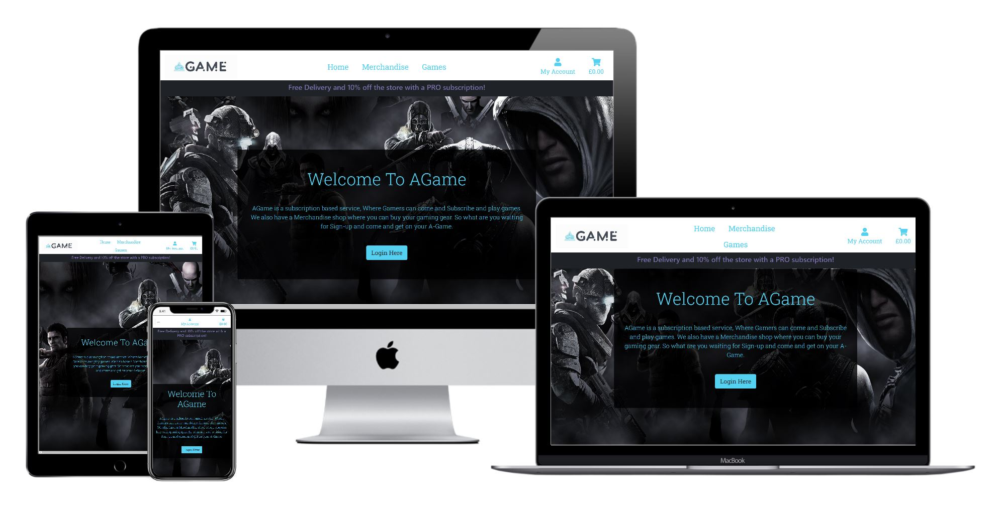

# AGame

## <i> Full Stack Frameworks With Django - Code institute MS4 project </i>

---

## Demo

---

**AGame** - Is an online Game subscription servicve where you can come and get on your A Game!

This is my AGame Website, that I have created using HTML, CSS, Javascript and Python code using Django and then deployed on Heroku. 
This website is intended for users to be able to be able to sign up for a Game subscription that will then enable them to download and then
play games, they will also be able to shop on the merchandise store. all while using having an account that can track their subscription status
and also view their account order history and cancel their subscription.

# UX

### **Project Goals**

The Aim of my project was to be able to create a site where the user could go to find games to play and then pay a small subscription fee to play them,
they could also shop on the merhandise store and be able to purchase products from this, and with a "PRO" subscription they would also get
10% off on the store and also free delivery as a perk to go from the free subscription to the PRO version. along with this they would also need
a profile account that they could login with, and with this track their order history and be able to cancel their subscription as they wish.

### User Stories

1. As a User I want to be able to view a list of games I can play so I can see what I want to play.
2. As a User I want to be able to Easily Register for an Account so I can View my profile.
3. As a User I want to be able to Easliy login and logout so I can Access my personal profile.
4. As a User I want to be able to Easily Recover my Password So I can regain Access to my Account.
5. As a User I want to be able to Recieve an Email Confirming After Registering on the site So I can Verify my Registration was successful.
6. As a User I want to be able to Have a Personlized account So I can view my order history and save my personal Information.
7. As a User I want to be able to see a specific category of product in the store so I can find what I want.
8. As a User I want to be able to Search for a Product by Name or description So that I can find a specific prouduct I want.
9. As a User I want to be able to Easily see what I have searched for So that I can decide wether I want the product.
10. As a User I want to be able to View individual Product Details So it can See the Price, description and information.
11. As a User I want to be able to View the total cost of my purchase at any time So I can avoid spending too much.
12. As a User I want to be able to View the subscriptions available to me So that I can see how much it costs.
13. As a User I want to be able to View the indiviudal games that I can play So that I can download them and play.
14. As a User I want to be able to cancel my subscription at any point So that I no longer pay for it.
15. As a User I want to be able to view my subscription status so that I can see if it is active or not.
16. As a User I want to be able to Login with a Social media Account So it's easier for me to be able to login.
17. As a Admin I want to be able to Add a product So that I can add new products to the merchandise page.
18. As a Admin I want to be able to Edit/Update an Item So that I can change details about the product.
19. As a Admin I want to be able to Delete a product So that I can remove item not for sale anymore.
20. As a Admin I want to be able to Add new Games So that I can increase the Library of Game avaialbe to a User.

### **Design**

Most of the design of my website came from inspiration from another Game subscription website such as 
[Xbox Game Pass](https://www.xbox.com/en-GB/xbox-game-pass)
This sites helped with the information that I was going to need and the layout of my website.

### layout

The Layout of the site was using a Grid formation and layout taken from the [Bootstrap](https://getbootstrap.com/) webiste, 
this webiste was designed heavily off the back of the Boutique Ado mini project, that was done just before this milestone project,
As I feel this had the perfect base layout for creating my webiste and a mobile first approach.

### Fonts

The fonts that I decided to use was "Roboto Slab" and "Sans serif" as a backup and found this using 
[Google fonts website](https://fonts.google.com/) Which worked well from my previous Project.

### Colours

The Colours were found from a website called [Color Combos](https://www.colorcombos.com/color-schemes/2026/ColorCombo2026.html)
the colours used were purple, grey and mostly a light blue as it complemented my AGame Logo.

### Icons

The Icons used on this site were taken from the website [Font Awesome](https://fontawesome.com/)

### WireFrames

The wireframes were created using the Balsamiq application, you can view my PDF of the wireframes
that were created at the beginning of this project and have not been modified based on the final look of the website. 
[Download Wireframes Here](https://github.com/djacura/AGame/raw/master/assets/AGame%20wireframes%20PDF.pdf)

# **Technologies Used**

This Project Uses HTML, CSS, Javascript, Python, and Django Technologies.

* [Python](https://www.python.org/) was used to create the logic code.
* [Django](https://www.djangoproject.com/) Django is a high-level Python Web framework.
* [Jquery](https://jquery.com/) was used for the Javascript Elements.
* [Bootstrap 4.5](https://getbootstrap.com/) Design and customize responsive mobile-first sites.
* [HTML 5](https://en.wikipedia.org/wiki/HTML) Markup language designed for the web browser.
* [CSS 3](https://en.wikipedia.org/wiki/Cascading_Style_Sheets) Style sheet language used for styling the HTML.
* [Github](https://github.com/) was used to store the code in a repository and then [Gitpod](https://www.gitpod.io/) was used to write the code.
* [Heroku](https://www.heroku.com/) was used to deploy the site to the internet.
* [Heroku Postgres](https://www.heroku.com/postgres) PostgreSQL's used for database.

# **Credits**

### Content
- The text for most of the site was added my myself and some of the games info were copied from the game website [Game](https://www.game.co.uk).
- The description and info for the products was mostly taken from the [Corsair](https://www.corsair.com/uk/en/) Website and also added myself.

### Media
- The images used in this site were obtained from the [Xbox](https://www.xbox.com) website store for these games.
- The image for the background image on the home page was from [Wallpaper House](https://wallpaper-house.com/).
- Some of the images were also from Code institute projects or old projects of my own.

### code and Acknowledgements

* The project’s code was developed by following the Code Institute and based on the understanding of the course material, 
The code has been customized by myself to fit with the purpose of my project. Some comments with the credits have been added where needed.

* The Django Documentation and Stack Overflow as well as some answers found on Slack have been referred to constantly
and super helpful in figuring the different coding practices I needed.

