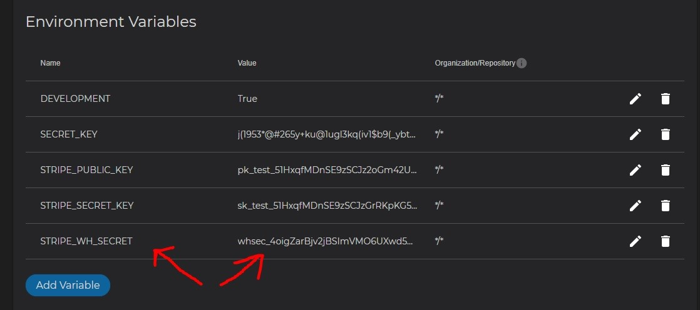
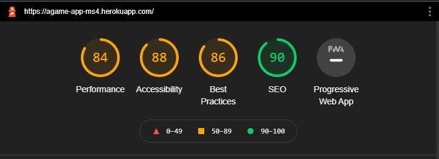
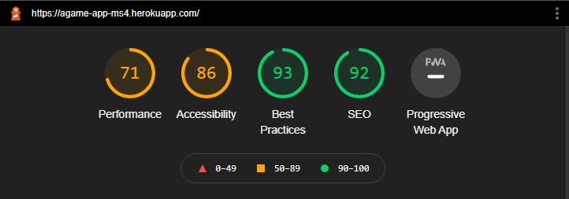

# Testing

1. [**Development Testing**](#development-testing)
2. [**Manual Testing**](#manual-testing)
   - [**Account testing**](#account-testing)
   - [**Merchandise store testing**](#merchandise-store-testing)
   - [**Games Testing**](#games-testing)
   - [**Subscription Testing**](#subscription-testing)
   - [**Admin testing**](#admin-testing) 
3. [**Other Bugs**](#other-bugs)
4. [**Validation**](#validation)

---

## Development Testing

Using Django Framework comes with a very useful Debug function, that when When Debug is True. If there is an error in the code the live server will stop and print out an error code. \
This is printed out in the terminal and on the localhost. And because of this feature a lot of the bugs get fixed as they happen. so there arent that many which is good.

---

## Manual Testing

So with the manual testing section of this I went through each of the user stories which I had come up with and checked each one to 
make sure that the website works the way that it should.

---

## Account testing

This section is all about how I tested the Account part of the website from user stories

#### User stories

- As a User I want to be able to Easily Register for an Account so I can View my profile.
- As a User I want to be able to Easliy login and logout so I can Access my personal profile.
- As a User I want to be able to Easily Recover my Password So I can regain Access to my Account.
- As a User I want to be able to Recieve an Email Confirming After Registering on the site So I can Verify my Registration was successful.
- As a User I want to be able to Have a Personlized account So I can view my order history and save my personal Information.
- As a User I want to be able to Login with a Social media Account So it's easier for me to be able to login.

#### Tests

- Clicked on the link to sign up for an account
- filled in my details to sign up
- the website then sent an email to confirm registration of account
- then logged back into website
- Clicked on my profile account link in my account at top nav bar
- Clicked on the reset password link in profile admin
- clicked on profile link to see order history
- updated personal details and clicked on the update information button
- clicked the logout button link in top nav bar
- Checked that loggin in through social media login worked

#### Test result

- the link correctly sent me to the signup form to signup for an account
- the details were okay and form validation was working as username was too short and email already exsisted
- The email was recieved to confirm email address
- successfully managed to login to website with details at signup
- the link successfully took me to my profile with all 3 blocks displaying correct information
- The link correctly took me to the reset password section and reset my password successfully
- the link successfully took me to my profile with the order history displaying correctly (if orders are present)
- details were successfully updated and changed and recieved success toast with correct message displayed
- successfully logged the user out and directed back to the homepage
- succesfully managed to login with a social account and create an account as well

### Bugs 

- No bugs were found during this testing section although did have an issue with displaying subscription even though subscription did
not exist yet so changed it so that all user that sign up get a free account straight away so this does not happen
and also changed the view on the profile page to reflect this.

---

## Merchandise store testing

This section is how I tested the Merchandise store part of the website

#### User stories

- As a User I want to be able to see a specific category of product in the store so I can find what I want.
- As a User I want to be able to Search for a Product by Name or description So that I can find a specific prouduct I want.
- As a User I want to be able to Easily see what I have searched for So that I can decide wether I want the product.
- As a User I want to be able to View individual Product Details So it can See the Price, description and information.
- As a User I want to be able to View the total cost of my purchase at any time So I can avoid spending too much.

#### Tests

- checked the merchandise store and clicked on the category heading link
- typed search term in the search bar at the top of the page
- then also searched for terms only in description of product
- clicked on multiple prouducts to go to the product detail page
- Checked that you could see all valid product details listed
- Checked that you could see the Total cost after adding products to your cart#
- Checked that adding an item to the cart added an item to the cart
- Checked that you could remove or update item in the cart
- Checked that clicking on the cart link at the top took you to the cart

#### Test result

- after clicking the category link the products from that category successfully listed on the screen
- This then successfully listed out the products that matched this search criteria
- successfully managed to find products that matched searh criteria in description text
- after logging in which you have to do to view product details could successfully see product details
- Could successfully see all product details incl Price, description and other information
- Added multiple items to the cart and successfully changed the total amount in cart to User
- successfully managed to add an item to the cart
- successfully managed to change the amount of an item in the cart and also remove that item altogether
- link successfully took you to the cart and also so did the buttons on the toast

### bugs

- No Bugs were found during testing of this section of the website.

---

## Games Testing

This section is about how I tested the games section of the website

#### User Stories

- As a User I want to be able to view a list of games I can play so I can see what I want to play.
- As a User I want to be able to View the indiviudal games that I can play So that I can download them and play.

#### Tests

- Clicked on the Game link in the top nav bar
- Checked that could not see games details as needed to be a Pro member
- Signed up for a subscrition to be able to play the games
- Checked that could then see a list of the games to be able to play
- Checked could see the games details page
- Checked could click the button to play the Game
- Checked could search for a game that I wanted to play

#### Test result

- The link successfully took me to the games section of the website 
- before subscription went through, successfully saw toast that said you have to be a Pro member to view games
- Then signed in successfully and successfully subscribed to the website
- then clicked on games and successfully viewed game detail page
- All game details successfully loaded correctly
- Clicked the button to play the game but nothing happened as links not real
- successfully searched for games on webiste using game name or description term

### Bugs

- No bugs were found during this section although originally had it so that you could not see the games at all without a subscrition, but
found this was not good as users could not see what games they could play without subscribing to the website so some users would not sign up
as they did not know what they could potentially play. 

#### Fixes

- so to fix this I changed the format so you could not see game details without a subscription membership and this was a better format.
and allowed the user to be able to see the games they could play before subscribing they were more likely to subscribe, this
also came from user testing as well.

---

## Subscription Testing

in this section I tested the aspects of the subscription part of the website.

#### User Stories

- As a User I want to be able to View the subscriptions available to me So that I can see how much it costs
- As a User I want to be able to cancel my subscription at any point So that I no longer pay for it.
- As a User I want to be able to view my subscription status so that I can see if it is active or not.

#### Tests

- Checked that when signing up for an account that a free account was created
- Checked that when logged in that my profile showed a free account status
- Checked that when logged in clicking on subscriptions took the user to the subscriptions page
- Checked that the Correct Price was shown for each Subscription tier
- Checked that clicking on subscribe that it took the user to the subscription payment page
- Chcked that after subscribing the membership status changed
- Checked that the user could successfully cancel thier Subscription

#### Test result

- When signing up for an account on the Profile page the correct Free account was shown
- When logged in could see the subscriptions link in the top nav (could not see this if not logged in)
- successfully Redirected user to the subscriptions payment page and loaded correct subscription details
- the correct Price was loaded for each subscription and so was the correct subscription info for each tier
- The subscription payment went through successfully and sent the user an email invoice and redirected them to their profile page
- This then also showed the correct subscription status and also then showed the subscription date and next payment date and cancel subscription button
- Clicking on the cancel subscription button successfully loaded the cancel modal
- Clicking on confirm cancel subscription cancelled the subscription and then showed the correct tier in the Profile

### Bugs

- No bugs were encountered during this stage of testing.

---

## Admin testing

In this section I tested the aspects of the Admin user and super user section of the website

#### User Stories

- As a Admin I want to be able to Add a product So that I can add new products to the merchandise page.
- As a Admin I want to be able to Edit/Update an Item So that I can change details about the product.
- As a Admin I want to be able to Delete a product So that I can remove item not for sale anymore.
- As a Admin I want to be able to Add new Games So that I can increase the Library of Game available to a User.

#### Tests

- Check the Add a Product part of the site
- Check the ability to edit/delete products from the merchandise pages
- Check the ability to add games to the site
- Check the ability to edit/delete games from the games pages
- Check links to edit/delete are visable to only admin and super users
- Check the ability of admin user to see the items in the corerct order in the admin panels

#### Test result

- Paged throughout all the pages of the website and the admin icon was always there.
- Logged in as admin all okay
- Clicked on the ‘Products’ button and clicked on the products name and picture,  
  I was redirected to products details, I was able to edit and delete a product on this page
- Clicked on the prouduct management in the top my account link and successfully added a product to the store
- Clicked on the Add a game management in the top of my account link and successfully added a new game
- Clicked on the ‘Games’ button and clicked on the game name and picture, 
  I was redirected to game details, I was able to edit and delete a game on this page
- successfully logged into the django admin and all items could be viewed and ordered correctly

### Bugs

- No bugs were encountered during this stage of testing.

---

<div align="right">

[Back to Top :arrow_up: ](#testing)

</div>
 <div align="left">

## Other Bugs

While testing here is Any other bugs that I managed to encounter while testing the website and during development

### Orders

- While Testing the website, I created an Order from the Merchandise store and found that after checkout I had 2 orders being created
in the order history section of my profile but was only getting one email confirmation.

> After searching through the Slack and online found that I must have an issue in my webhook handler.

### Fix

Then searching through found that the I had it so that when you are subscribed to the website it created a second account for the user
so i then changed the webhook handler to check for a subscription creation event and then add a send email function so that
it wouldnt recognise this as a second order and it fixed this issue.

---

### Payment Intent Error

- While Testing the website found that when trying to save the user details it would not save the correct info and anytime an order was created
I was getting an Payent Intent Error coming up.

> After checking the error report and serching around online found that this was probably being created because I had not written the code
correctly somewhere in the files.

### Fix

After searching through the django error console and through the code found that I had spelled something incorrectly.

```python
    order_form = OrderForm(initial={
        'full_name': profile.default_full_name,
        'email': profile.user.email,
        'phone_number': profile.default_phone_number,
        'country': profile.default_country,
        'postcode': profile.default_postcode,
        'tonw_or_city': profile.default_tonw_or_city,
        'street_address1': profile.default_street_address1,
        'street_address2': profile.default_street_address2,
        'county': profile.default_county,
    })
```

It was the fact that I had spelled the Town or city incorrect and that was bringing up the error.

---

### Delivery Info Not Showing

- While testing had an issue where the delivery info was not showing when succesfully completing an order and being on the order confirmation
page the delivery info was missing from the order.

> While checking through the code and on slack I found the answer to my error.

### Fix

After going through the code and comparing to the code used previously I found the error:

```python
    if save_info:
        profile_data = {
            'default_full_name': order.full_name
            'default_phone_number': order.phone_number
            'default_country': order.country
            'default_postcode': order.postcode
            'default_town_or_city': order.town_or_city
            'default_street_address1': order.street_address1
            'default_street_address2': order.street_address2
            'default_county': order.county
        }
        user_profile_form = UserProfileForm(profile_data, instance=profile)
        if user_profile_form.is_valid():
            user_profile_form.save()
```

I Had forgot the Comma on the end of the line in the save_info section of the checkout views.py files

```python
    if save_info:
        profile_data = {
            'default_full_name': order.full_name,
            'default_phone_number': order.phone_number,
            'default_country': order.country,
            'default_postcode': order.postcode,
            'default_town_or_city': order.town_or_city,
            'default_street_address1': order.street_address1,
            'default_street_address2': order.street_address2,
            'default_county': order.county,
        }
        user_profile_form = UserProfileForm(profile_data, instance=profile)
        if user_profile_form.is_valid():
            user_profile_form.save()
```

The commas where then added and this then fixed the issue I was having.

---

### Stripe Country Field Not Grey

- I had an issue where the Stripe Country Field was not showing Grey for the default

> When I checked this I know thjat this came up in the Boutique Ado mini project as an issue so I knew what it might be

### Fix

When checking the code found that the issue was that I had not put the Javascript for the element in the file.

```python
    
        {{ block.super }}
        {{ stripe_public_key|json_script:"id_stripe_public_key" }}
        {{ client_secret|json_script:"id_client_secret" }}
        <script src=""></script>
    
```
The code should have had the Stripe country field JS file that I had written in the postloadjs section of the checkout as you can see below

```python
    
        {{ block.super }}
        {{ stripe_public_key|json_script:"id_stripe_public_key" }}
        {{ client_secret|json_script:"id_client_secret" }}
        <script src=""></script>
        <script type="text/javascript" src=""></script>
    
```

---

### Stripe 400 Error

- When Carrying out an order or subscribing to the website found was getting an Stripe 400 error coming up

> When Checking on slack and also on the internet with the error code found that it must be an issue with the Stripe id_stripe_public_key

### Fix

When Checking the settings on the website and also on Heroku found that the STRIPE_WH_SECRET key was not correct from Stripe



As you can see from the above image I then corrected this an copied over from Stripe the correct secret key


---

### Bugs not fixed

I have this one bug I cant seem to fix and have checked all things and online and cant seem to solve it I hopefully will be able to go back and sort 
this out once I have better knowlodge of this.

> The issue I am having is that when you go to the cart page the decrement selector and increment selector buttons do not
grey out and disable when at 1 and 99 like they do on my product detail page.

I am hoping to solve this at some point but including it here in case I didnt manage to. its not a major error on the website as when you do go below
1 on the selector the money does not go down, it just removed the product from the cart altogether so is manageable.

---

# Validation

This Section is all about the Validation I carried out on the website.

### HTML

- All HTML pages were tested with W3C Markup Validation Service. There are a good few errors because the W3C Markup does not recognize Jinja templating. No other errors.

### CSS

- I ran my css file through the W3c CSS Validation Service.
- I got a couple of errors all pointing to (min-device-width) which is for a media query but checked and it works perfectly.

### python

 - I ran my python code through [pep8 online](http://pep8online.com/) Checker and fixed any issues that occured
 - Apart from a lot of line too long mostly due to comments which some can be moved so I did and some I couldn`t work out how to fix

### Lighthouse Tests

- I ran lighthouse checks for both mobile and desktop view and other than image sizes and file generation was really good.

#### Lighthouse desktop :



#### Lighthouse mobile :



Overall I am happy with all the testing carried out and no Major errors or Breaks to the site.

<div align="right">

[Back to Top :arrow_up: ](#testing)

</div>
 <div align="left">